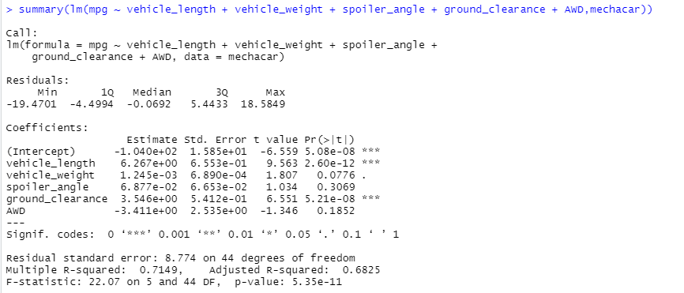
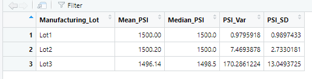
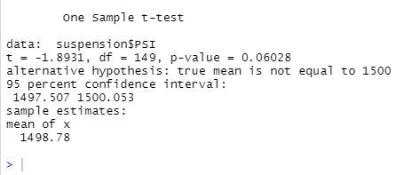
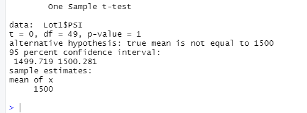
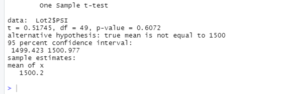
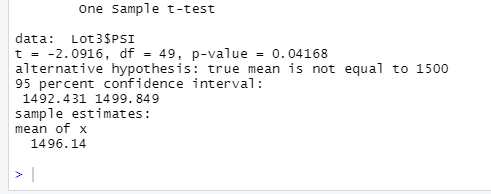

# MechaCar_Statistical_Analysis

## Linear Regression to Predict MPG

The vehicle length and vehicle ground clearance provide a non-random amount of variance to the mpg values, and therefore have a significant impact on miles per gallon. The other factors have p-values that indicate a random amount of variance.

The slope of this linear model is NOT considered to be zero, because of the p-value. The p-value, at 5.35e-11, is much smaller than the significance level of 0.05%. A low p-value suggests the slope is not zero.

In order to measure the effectiveness of any linear model, we look to the R-squared value, which is 0.7149. Higher R-squared values represent smaller differences between the observed data and the fitted values. In this case, our R-squared of 0.7149 is relatively high, and suggests that the model effectively predicts the mpg of MechaCar prototypes. 

## Summary Statistics on Suspension Coils

Design specifications dictate that the variance of the suspension coils must not exceed 100 pounds per square inch. The current manufacturing data shows our variance at 62.29356, meaning our suspension coils make the design specification cut for the entire population of the production lot. However, for the individual lots, we see a different picture. Lot 1 and Lot 2 have PSI Variances of 0.9795918 and 7.4693878 respectively. Our last lot, Lot 3, has a PSI Variance of 170.2861224, which is well above the 100 PSI Variance limit in the design specifications. This lot variance is drastically skewing the entire population of the coils. 

## T-Tests on Suspension Coils

After running our ttest on the whole coil population, we can see some of the summary statistics. Our P-Value is 0.06, meaning we are failing to reject the null hypothesis, as it is higher than the common significance level of 0.05. 

Looking at the individual lots, Lot 1 shows a P-Value of 1, meaning we are again failing to reject the null hypothesis. Lot 2 has a p-value of 0.61, meaning we are going to reject its null hypothesis, meaning there is a significant difference. With our Lot 3, our P-Value is again less than 0.05, at 0.04, meaning we are rejecting the null hypothesis. 

## Study Design: MechaCar vs Competition

Metrics to be tested:
    - Cost
    - Highway Fuel Efficiency
    - Safety Feature Rating

Null Hypothesis (Ho):
    - MechaCar's cost is correctly set based on its highway effeciency and safety features relative to other cars of the same category. 
Alternative Hypothesis (Ha): 
    - MechaCar's cost is not correctly set based on its highway effeciency and safety features relative to other cars of the same category.

The statistical test to be used for this study would be a multiple linear regression model. This would allow us to compare Highway Fuel Efficiency and Safety of MechaCar and other brands to determine which of the points is more impactful on price, and therefore which car might sell more.